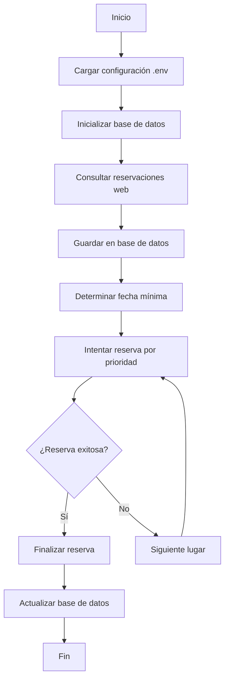

# 🏢 Sistema Automatizado de Reserva de Lugares

Sistema inteligente para automatizar la reserva de lugares en el sistema de hoteling de Deloitte, con persistencia en base de datos SQLite y configuración flexible a través de variables de entorno.

## ✨ Características Principales

- **🧠 Inteligencia Automática**: Consulta reservaciones existentes antes de intentar nuevas reservas
- **🗄️ Persistencia**: Base de datos SQLite para evitar duplicados y mantener historial
- **⚙️ Configuración Flexible**: Variables de entorno para lugares y días de reserva
- **📅 Gestión de Fechas**: Solo reserva fechas posteriores a las reservaciones existentes
- **🔄 Recuperación de Errores**: Sistema robusto con manejo de errores y reintentos
- **📊 Reportes Detallados**: Logging completo del proceso y estadísticas

## 🚀 Instalación y Configuración

### 1. Instalar Dependencias

```bash
pip install -r requirements.txt
playwright install chromium
```

### 2. Configurar Variables de Entorno

Crea o edita el archivo `.env` en el directorio raíz:

```env
# Configuración de lugares para reserva
# Lista de lugares separados por comas (en orden de prioridad)
LUGARES_RESERVA=P17-1302,P17-1602,P17-1202,P17-1001,P17-1002,P17-1003

# Días de la semana para reservar
# 0=Lunes, 1=Martes, 2=Miércoles, 3=Jueves, 4=Viernes, 5=Sábado, 6=Domingo
DIAS_RESERVA=2,3
```

## 📖 Uso del Sistema

### Modo Principal (Reserva Automática)

```bash
python CargaLugar.py
```

**Proceso automático que ejecuta:**
1. 🔍 Consulta reservaciones existentes
2. 📅 Determina la siguiente fecha disponible
3. 🎯 Intenta reservar en orden de prioridad de lugares
4. 💾 Finaliza la reserva y actualiza la base de datos

### Modo Consulta (Solo Ver Reservaciones)

```bash
python CargaLugar.py --consultar
```

**Solo consulta y muestra:**
- Reservaciones actuales del sitio web
- Reservaciones guardadas en la base de datos local

### Script Auxiliar para Base de Datos

```bash
python consultar_db.py
```

Permite consultar directamente la base de datos local sin acceder al sitio web.

## 🏗️ Arquitectura del Sistema

### Estructura del Código (Reorganizada)

```
CargaLugar.py
├── 📁 Configuración y Constantes
├── 🔧 Funciones de Utilidad y Validación
├── 🗄️ Funciones de Base de Datos
├── 🌐 Funciones de Consulta Web
├── 🎯 Funciones de Reserva
└── 🚀 Funciones Principales
```

**Mejoras en la organización:**
- ✅ **Sin duplicación**: Eliminadas todas las funciones duplicadas
- ✅ **Organización lógica**: Funciones agrupadas por responsabilidad
- ✅ **Tipado fuerte**: Type hints para mejor mantenimiento
- ✅ **Documentación**: Docstrings descriptivos en todas las funciones
- ✅ **Separación de responsabilidades**: Cada función tiene un propósito claro

### Base de Datos SQLite

**Tabla: `reservaciones`**
- `id`: Clave primaria auto-incremental
- `fecha_consulta`: Timestamp de cuando se consultó
- `columna_1` a `columna_10`: Datos de la reservación
- `fecha_reserva`: Fecha de la reservación (formato DD/MM/YYYY)
- `fila_completa`: Datos completos de la fila

### Flujo de Trabajo Inteligente



## 📊 Funcionalidades Detalladas

### 🎯 Sistema de Prioridades
- Intenta reservar lugares en el orden especificado en `LUGARES_RESERVA`
- Se detiene en el primer lugar que permita reservas exitosas
- Reporta intentos fallidos y éxitos claramente

### 📅 Gestión Inteligente de Fechas
- **Evita duplicados**: Solo reserva fechas posteriores a las existentes
- **Respeta configuración**: Solo procesa días especificados en `DIAS_RESERVA`
- **Optimización temporal**: Inicia desde la siguiente fecha disponible

### 🗄️ Persistencia Robusta
- **Unicidad**: Previene duplicados con restricciones de base de datos
- **Historial completo**: Mantiene registro de todas las consultas
- **Recuperación**: Puede reconstruir estado desde la base de datos

### 🔧 Validación y Configuración
- **Formato de lugares**: Valida formato P##-#### automáticamente
- **Días válidos**: Valida rango 0-6 para días de la semana
- **Valores por defecto**: Fallback automático si la configuración es inválida

## 🛠️ Funciones Principales (Reorganizadas)

### Configuración y Validación
- `configurar_variables_entorno()`: Carga y valida configuración desde .env
- `validar_lugares()`: Valida formato de lugares (P##-####)
- `validar_dias()`: Valida días de la semana (0-6)
- `mostrar_configuracion()`: Muestra configuración actual

### Base de Datos
- `inicializar_base_datos()`: Crea tabla si no existe
- `guardar_reservacion()`: Guarda reservación con datos completos
- `mostrar_reservaciones_guardadas()`: Lista reservaciones en DB
- `obtener_ultima_fecha_reservada()`: Encuentra última fecha reservada
- `obtener_siguiente_fecha_disponible()`: Calcula siguiente fecha para reservar

### Consulta Web
- `consultar_reservaciones_actuales()`: Scraping de reservaciones desde web

### Reserva Automatizada
- `intentar_reserva_lugar()`: Intenta reservar un lugar específico
- `realizar_proceso_reserva()`: Coordina reserva con todos los lugares
- `finalizar_reserva()`: Confirma reserva con clic en botón

### Funciones Principales
- `ejecutar_proceso_completo()`: Flujo principal de reserva
- `consultar_reservaciones_main()`: Modo solo consulta

## 🛠️ Mantenimiento y Solución de Problemas

### Logs y Monitoreo
El sistema proporciona logging detallado:
- ✅ Acciones exitosas (verde)
- ❌ Errores (rojo)
- ⚠️ Advertencias (amarillo)
- 📊 Estadísticas y resúmenes

### Comandos Útiles

**Ver estado de la base de datos:**
```bash
python consultar_db.py
```

**Limpiar y reinicializar base de datos:**
```bash
rm reservaciones.db
python CargaLugar.py --consultar
```

**Verificar configuración:**
```bash
python -c "from dotenv import load_dotenv; import os; load_dotenv(); print('Lugares:', os.getenv('LUGARES_RESERVA')); print('Días:', os.getenv('DIAS_RESERVA'))"
```

### Problemas Comunes

1. **"No hay lugares válidos"**
   - Verificar formato en `.env`: `P17-1001,P17-1002`
   - Usar formato P##-#### exacto

2. **"No hay días válidos"**
   - Verificar rango 0-6 en `DIAS_RESERVA`
   - Ejemplo: `2,3` para Miércoles y Jueves

3. **"Error de conexión"**
   - Verificar conectividad a intranet de Deloitte
   - Reintentar después de unos minutos

4. **"Base de datos bloqueada"**
   - Cerrar otras instancias del programa
   - Reiniciar si es necesario

## 📋 Archivos del Proyecto

```
CargaLugar/
├── CargaLugar.py          # Script principal (REORGANIZADO)
├── consultar_db.py        # Script auxiliar para consulta DB
├── .env                   # Configuración (crear manualmente)
├── requirements.txt       # Dependencias Python
├── README.md             # Esta documentación
└── reservaciones.db      # Base de datos SQLite (auto-generada)
```

## 🔮 Características Avanzadas

### Modo de Solo Consulta
Permite verificar el estado sin realizar reservas:
```bash
python CargaLugar.py --consultar
```

### Configuración Dinámica
Cambios en `.env` se aplican inmediatamente sin modificar código.

### Recuperación de Estado
El sistema puede continuar desde donde se quedó usando la base de datos.

### Validación Automática
Valida formatos y configuraciones automáticamente con valores por defecto.

## 🎯 Mejoras Implementadas en esta Versión

### ✅ Reorganización Completa del Código
- **Eliminación de duplicados**: Todas las funciones duplicadas han sido removidas
- **Estructura lógica**: Código organizado en secciones claras y coherentes
- **Tipado fuerte**: Type hints añadidos para mejor mantenimiento
- **Documentación mejorada**: Docstrings descriptivos y comentarios útiles

### ✅ Optimización del Flujo
- **Variables globales eliminadas**: Todas las variables ahora se pasan como parámetros
- **Funciones modulares**: Cada función tiene una responsabilidad específica
- **Manejo de errores mejorado**: Gestión más robusta de excepciones
- **Logging más detallado**: Información más clara sobre el progreso

### ✅ Mantenibilidad Mejorada
- **Separación de responsabilidades**: Configuración, DB, web y reserva en secciones separadas
- **Reutilización de código**: Funciones auxiliares bien definidas
- **Fácil extensión**: Estructura que permite agregar nuevas funcionalidades fácilmente
- **Testing friendly**: Funciones independientes fáciles de probar

---

**Sistema completamente reorganizado y optimizado para máxima eficiencia y mantenibilidad.**
